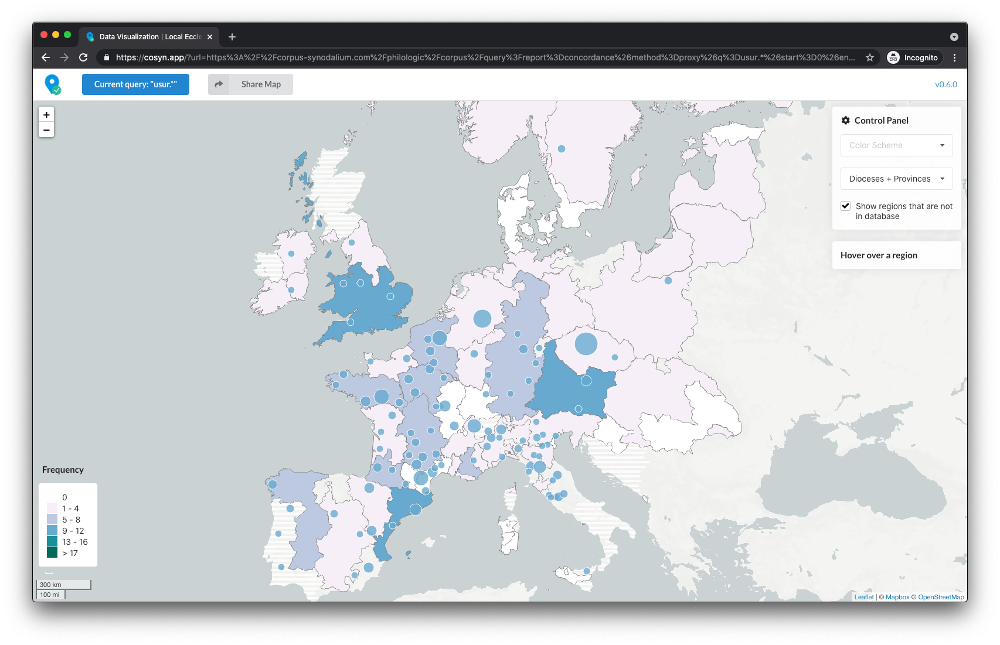
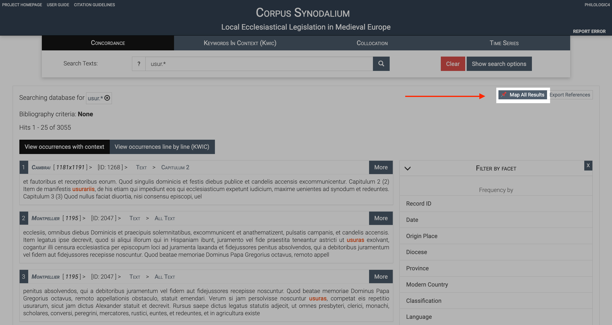

# cosyn.app

[](https://app.netlify.com/sites/awesome-react-map/deploys)

## About

This repo contains source files for https://cosyn.app/ which is a web-app used for mapping search results from the Corpus Synodalium [database](https://corpus-synodalium.com/philologic/corpus/).



## How to use the app

-   Go to [Corpus Synodalium database](https://corpus-synodalium.com/philologic/corpus/).
-   Make a search query.
-   Click on the `Map All Results` button at the top-right corner.
-   [cosyn.app](https://cosyn.app/) will open in a new tab and display the mapping of the search results.



## Technical Notes

This project was built using [React](https://reactjs.org/) and [Leaflet](https://react-leaflet.js.org/).

Here is a list of useful libraries.

-   [React JS](https://reactjs.org/): Web framework used for this app.
-   [Leaflet](https://leafletjs.com/): Light-weight Javascript library for interactive maps. This project uses react-leaflet instead of the vanilla Leaflet library. (See below).
-   [react-leaflet](https://react-leaflet.js.org/): React components for 🍃 Leaflet maps.
-   [create-react-app](https://github.com/facebook/create-react-app): This project was set up using create-react-app.
-   [Color Brewer 2](http://colorbrewer2.org): Color scheme for readable maps.
-   [MapShaper.org](https://mapshaper.org/): Useful for viewing and compressing GeoJSON files.
-   [geojson-precision](https://www.npmjs.com/package/geojson-precision): Command line tool to compress GeoJSON file by reducing level of precision. (e.g. `57.326` instead of `57.32652122521709`)

Here is a list of resources related to deployment.

-   [Netlify](https://www.netlify.com/): This project is deployed using Netlify. Whenever a new commit is pushed to the master branch of this repo, Netlify will automatically build and deploy the new website. It's super convenient!
-   [Amazon CloudFront](https://aws.amazon.com/cloudfront/): The geo-json file (2 MB) required for region boundaries is compressed and hosted on Amazon CloudFront CDN (Free tier is sufficient since it is cached heavily).

## How to compress GeoJSON files

-   First, reduce precision to 4 using [geojson-precision](https://www.npmjs.com/package/geojson-precision) npm package.

```
npx geojson-precision -p 4 input.json output.json
```

-   Next, upload the output file from step 1 to [MapShaper.org](https://mapshaper.org/). Click "Simplify". Default options are fine. Drag the slider to control the amount of details in the map. Click "Export" and choose GeoJSON.

-   Finally, gzip the output file from step 2.

```
gzip output.json
```

That's it! Here are the results from my testing with a sample GeoJSON file.

-   Original file: `28.3 MB`
-   After step 1 (reducing precision): `12.9 MB`
-   After step 2 (simplifying): `2 MB`
-   After step 3 (gzip): `0.56 MB` (98% size decrease from original file)

The smaller size helps make the network requests faster. 🚀

The compressed GeoJSON file is hosted on AWS Cloudfront CDN. This step is optional, but should improve the speed. You need to set the content metadata in S3. Here is the metadata information for future reference.

| Key              | Value                    |
| ---------------- | ------------------------ |
| Content-Type     | application/json         |
| Content-Encoding | gzip                     |
| Cache-Control    | public, max-age=31536000 |
